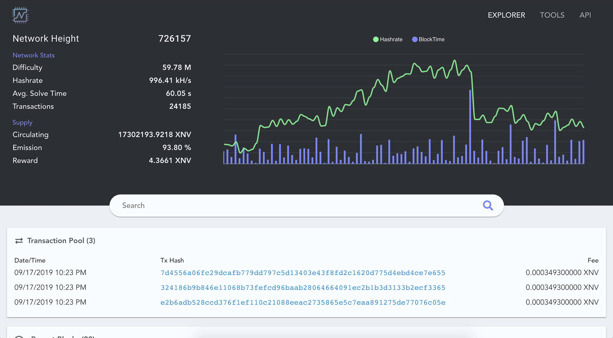

WAZN Explorer | Blockchain Browser
======================

[](https://opensource.org/licenses/EUPL-1.2)

## Project setup

#### Install @vue/cli dev tools

```bash
npm install -g @vue/cli
```

#### Clone the project and install dependencies

```bash
git clone https://github.com/vermin/wazn-explorer.git
cd wazn-explorer
npm install
```

#### Compile with hot-reloading for development

```bash
npm run dev
```

#### Compile and minify for production

```bash
npm run build
```

#### Build with URL path

Set `VUE_PUBLIC_PATH=/<path>/` in `./env.withpath`

```bash
npm run build-with-path
```

#### Hosting
Some specific configuration may be needed depending on your web server.

For nginx
```nginx
location / {
    try_files $uri $uri/ /index.html;
}
```

See the [vue-router history mode docs](https://router.vuejs.org/guide/essentials/history-mode.html#example-server-configurations).




## License
```
Licensed under the EUPL-1.2
Copyright (c) 2020 WAZN Project  
Copyright (c) 2019 jerme404
```
